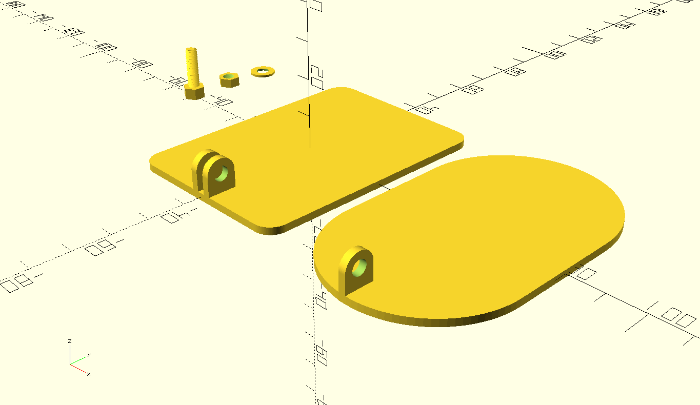

# Summary

3D model for a simple wall mount designed for the lidl zigbee PIR sensor

# Dependencies

In order to use it, you need to have the [threads](https://github.com/rcolyer/threads-scad) openscad library.

# External references

This is also shared on [thingverse](https://www.thingiverse.com/thing:5369659).
